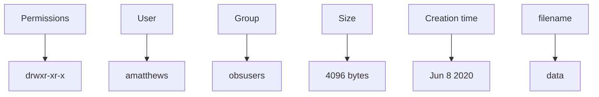
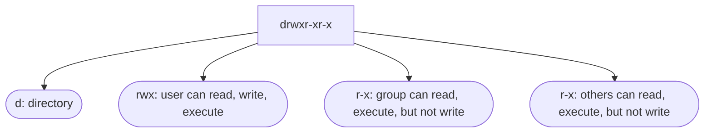

## Me, my shell, and I: Tips and tricks for working in a UNIX environment

### UNIX Introduction
UNIX is an operating system first developed in the 1960s, but remains under constant development to this day. It is made up of three parts: 1) the kernel, 2) the shell, and 3) the programs. This is all about the shell---which interfaces between the kernel (the hub of the operating system) and the user (you!). 
<center>

#### Why learn UNIX?

#### Opening a terminal: 
There are many ways to open a terminal (also called the "command line") on either Mac or Linux machines, but here are some quick options:
On a Mac: ⌘ _Cmd_ + _Space_ and type _terminal_, hit enter.
On a Linux: Click _Applications_ &rarr; _System Tools &rarr; _Terminal_.
On a Windows: (to-do)

There are different types of shells (e.g. `bash`, `csh`, `zcsh`, etc.), but we will be using the `bash` shell. To check what shell you're using, type: `echo $SHELL` in the terminal. We'll talk more about what `echo` does later on.
### Directories and Navigation
First, let's get familiar with navigating the filesystem on our computer. The home directory is indicated by the special character ~. On a Mac, this is equivalent to /Users/[your computer name]. 
| **COMMAND** | **ACTION** |
|--|--|
| `pwd`   | (**p**resent **w**orking **d**irectory) show the full path of your current directory |
| `cd`    | (**c**hange **d**irectory), alone this will go to your home directory |
| `cd -`  | go to the last directory you were in |
| `cd ..` | go up one directory |
| `ls`    | **l**i**s**t items in directory |
| `ls -l` | a "long listing" of items in the current directory with time of creation and file permissions |
| `mkdir` | **m**a**k**e new **dir**ectory within current directory |
| `chmod` | 


Lines that begin with **d** indicate directories. The first column lists the file/directory permissions: **r**: read permission, **w**: write permission, **x**: execute permission. 

Let's explore the Permissions a little more:


### Control Characters
Suppose you're trying to run a python script and notice you made a typo at the very beginning of the line. Instead of hitting the left arrow repeatedly, you can type `cntrl-a` and your cursor will move to the start of the line.

Sometimes you haven't had your tea or coffee yet and you start running a program before realizing you forgot to change a parameter or filename within the code. The good news is you don't have to wait until the program finishes to go back and make your changes. Instead, typing `cntrl-c` into the terminal will cancel whatever command is running.

Here is an incomplete list of some control characters that make life just a little more efficient:
| **CONTROL CHAR** | **ACTION** |
| -- | -- |
| `cntrl-a` | move cursor to start of line |
| `cntrl-e` | move cursor to end of line |
| `cntrl-c` | cancel command |
| `cntrl-l` | clear terminal screen |
| `cntrl-k` | delete from cursor to end of line |
| `cntrl-a cntrl-k` | go to beginning of line and delete whole line |

### Tab Completion
If you start typing a few characters of a file or directory, e.g.
>`$ cd Downl`

and then hit the `tab` key. The shell will automatically complete the directory (or file) name that matches the start of what you typed. This can be _very_ helpful with long filenames. The shell will complete the name until there is no longer a unique match. Example: suppose you had a directory with the following files:
> ```
> Tile_8615432346_15.pkl 
> Tile_8615432350_15.pkl
> Tile_8615432357_15.pkl

Typing `ls -l Ti` and then `tab` will result in this on the command line:
>```ls -l Tile_86154323```

Entering another character (say `4`) will result in only one unique match, and then `tab` will complete the enter filename 
>```ls -l Tile_8615432346_15.pkl```

### Aliases
If typing `ls -l` more trouble than it's worth, we can make an alias for it! 
### Miscellaneous

